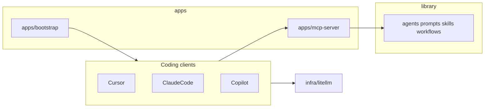

# Central AI stack: where everything goes (v2 map)

This document is the **canonical blueprint** for the central AI stack monorepo: folder layout, what migrates from this repo, exclusions, checklists, infra vs apps, `.gitignore`, and future lean `agent-configurations` hub. It subsumes the earlier short “monorepo structure”-only draft.

---

## 1. Read the diagram as a beginner

Think of four layers:

| Top-level folder                          | Purpose (plain English)                                                                                                                                                     |
| ----------------------------------------- | --------------------------------------------------------------------------------------------------------------------------------------------------------------------------- |
| **`library/`**                            | **The product**: reusable agent definitions, rules, prompts, skills, workflows, JSON schemas, and generated indexes. This is what MCP and tools should **search/list/get**. |
| **`apps/`**                               | **Things that run**: the MCP server, optional sync/registry service, and **bootstrap** snippets/scripts so each IDE (Cursor, Claude Code, Copilot) can install config.      |
| **`docs/`**                               | **Human narrative**: architecture write-ups, runbooks, ADRs (“why we decided X”). Not the same as executable library assets—though docs can **link** into `library/`.       |
| **`infra/`**                              | **How services are deployed**: LiteLLM, MCP compose files, observability, VPS bootstrap. Secrets stay out of git (`.env.example` only).                                     |
| **`scripts/`** + **`.github/workflows/`** | **Automation**: validate/generate/sync library, deploy, CI.                                                                                                                 |

The doc’s **Phase 1–5 checklist** at the bottom is still the right **delivery order**: stabilize layout and `library/` first, then MCP tools, then storage, then secrets/deploy, then Langfuse.



---

## 2. One extension to the HOW-TO tree (your content needs it)

The baseline diagram does **not** list a **`library/templates/`** folder. ADLC/Speckit files under `knowledge/global/adlc/` (and duplicates under `mcp-server/knowledgebase/templates/`) are **document templates**, not instructions or JSON schemas.

**Recommendation:** add:

`library/templates/adlc/` — e.g. `PRODUCT_SPEC.template.md`, `ENGINEERING_DESIGN.template.md`, `QA_TEST_SPEC.template.md`, `RELEASE_SPEC.template.md`, plus a short `README.md` or `SPECKIT.md` index.

Workflow YAML under `library/workflows/` can **reference** these paths by convention.

---

## 3. What does **not** belong in the new AI stack monorepo (leave behind)

Goal: **library v2 stays small, canonical, and deployable.** If something is not part of “shared agents + skills + workflows + MCP + infra for the stack,” it usually **should not** move—or it belongs in a **personal notes repo** / **archive branch**, not in `main`.

### 3.1 Exclude entirely (do not migrate)

| Artifact                              | Why                                                                                                                                                                                                                                                 |
| ------------------------------------- | --------------------------------------------------------------------------------------------------------------------------------------------------------------------------------------------------------------------------------------------------- |
| **Local / machine junk**              | e.g. `.bifrost/` SQLite WAL/SHM, `node-v*-x64.msi` installers, editor temp DBs — not reproducible, not part of the stack. Use root `.gitignore` (§9); never commit.                                                                                 |
| **`ideas/`**                          | Product/business idea notes (marketplace, SaaS, etc.). Valuable personally, **not** the central AI library. Keep in a separate repo or notes system.                                                                                                |
| **Superseded one-off migration docs** | e.g. `docs/MIGRATION-CHECKLIST.md` (“copy agent-library into MCP project”) — targets an old layout; **replace** with v2 onboarding in the new repo’s `README` / `docs/`, not a blind copy.                                                          |
| **Old implementation plans**          | e.g. `plans/implementation-plan-naf-mcp-server.md` — if it was a **scratchpad for a past milestone**, archive or keep outside the monorepo; only keep plans that remain **active roadmap** for the stack, under `docs/plans/` or `docs/decisions/`. |

### 3.2 Do not duplicate (merge once, then delete the extra)

| Situation                                                                        | What to do                                                                                                                                |
| -------------------------------------------------------------------------------- | ----------------------------------------------------------------------------------------------------------------------------------------- |
| **Two** `WORKFLOW_COMMANDS.md` / ADLC templates                                  | **One** canonical file in `library/` or `docs/`; remove embedded copies under `mcp-server/knowledgebase/` once MCP reads from `library/`. |
| **Multiple skill trees** (`.claude/skills`, `skills/claude`, `.opencode/skill`…) | **Do not** copy all trees into v2 — **merge** into `library/skills/` and drop duplicates.                                                 |
| **Bootstrap vs library**                                                         | `apps/bootstrap/templates/` should be **thin stubs** (paths, env hints); **not** a second full copy of `AGENTS.md` long-term.             |

### 3.3 Optional: curate (keep v2 “generic” vs “vertical” packs)

**Policy for your v2:** the **central monorepo** keeps **general software delivery** agents; **very domain-specific** agents stay in **per-project** repos (or a future optional bundle), not in the default `library/agents/`.

- Vertical agents (games, Unity, Steam, mobile-store ops, narrative, indie product ideation, Elastic-specific) → **do not** copy into generic v2 by default.
- **Skills** that only apply to one vertical follow the same rule (merge canonical skills into `library/skills/`; leave game-only skills out unless you add an optional pack).

#### 3.3.1 Exact agent split (post-cleanup `agents/` — **63** `.agent.md` files)

**Consolidations (no separate files in repo):** `adr-generator` → **`architecture-decision`**; `test-writer` → **`test-generator`**; `workflow-orchestrator` → **`orchestrator`** (workflows documented there).

**Counts:** **45** files → generic v2 `library/agents/` · **18** files → project-only / optional vertical pack below.

**Carry into generic v2 `library/agents/` (45)**

Copy these as your default portable library (alphabetical):

`ac-test-planner.agent.md` · `accessibility.agent.md` · `ai-agent-expert.agent.md` · `angular-expert.agent.md` · `api-designer.agent.md` · `architecture-decision.agent.md` · `azure-principal-architect.agent.md` · `backend-developer.agent.md` · `blueprint-mode.agent.md` · `changelog.agent.md` · `code-analysis.agent.md` · `code-cleanup.agent.md` · `container-expert.agent.md` · `csharp-dotnet-janitor.agent.md` · `csharp-expert.agent.md` · `csharp-mcp-expert.agent.md` · `data-migration.agent.md` · `database-designer.agent.md` · `dependency-audit.agent.md` · `devops-expert.agent.md` · `documentation.agent.md` · `dotnet-upgrade.agent.md` · `frontend-developer.agent.md` · `fullstack-developer.agent.md` · `github-actions.agent.md` · `graphql-architect.agent.md` · `log-forensics.agent.md` · `microservices-architect.agent.md` · `mobile-developer.agent.md` · `observability-engineer.agent.md` · `openapi-client-builder.agent.md` · `orchestrator.agent.md` · `performance-profiler.agent.md` · `plan.agent.md` · `pr-description.agent.md` · `react-expert.agent.md` · `requirements-engineer.agent.md` · `security-check.agent.md` · `tech-debt-analysis.agent.md` · `test-generator.agent.md` · `tooling-engineer.agent.md` · `troubleshooting.agent.md` · `ui-automation-tester.agent.md` · `ui-designer.agent.md` · `vue-expert.agent.md`

**Leave at project level (or optional `library/agents/verticals/games/` pack later) — 18**

| File                                        | Why project-level                                                   |
| ------------------------------------------- | ------------------------------------------------------------------- |
| `creative-writing.agent.md`                 | Fiction / game writing voice — content domain, not core SE library. |
| `elasticsearch-observability.agent.md`      | Elastic-specific O11y/RAG — vendor vertical.                        |
| `game-design.agent.md`                      | Game systems / economy / retention — games domain.                  |
| `game-director.agent.md`                    | Cross-game orchestration — games domain.                            |
| `lore-ip-screening.agent.md`                | Lore + IP heuristics — games/content compliance niche.              |
| `mobile-games-market-intelligence.agent.md` | Mobile games market / charts — games industry intel.                |
| `mobile-game-shipping.agent.md`             | App Store / Play game release — store + games compliance niche.     |
| `narrative-designer.agent.md`               | Branching dialogue / lore architecture — games narrative.           |
| `narrative-engagement.agent.md`             | Narrative retention critique — games.                               |
| `product-discovery.agent.md`                | Indie product discovery / niche selection — product ideation.       |
| `product-strategist.agent.md`               | Indie SaaS ideation / monetization — same.                          |
| `solo-business-strategist.agent.md`         | Solo business strategy — separate from SE delivery.                 |
| `steam-pc-deck.agent.md`                    | Steam / PC / Deck distribution — PC games distribution niche.       |
| `unity-architect.agent.md`                  | Unity architecture — engine vertical.                               |
| `unity-editor-tool-developer.agent.md`      | Unity editor tooling — engine vertical.                             |
| `unity-expert.agent.md`                     | Unity gameplay/engine — engine vertical.                            |
| `unity-multiplayer-engineer.agent.md`       | Unity multiplayer — engine vertical.                                |
| `unity-shader-graph-artist.agent.md`        | Unity shaders/VFX — engine vertical.                                |

**Adjustments you might make later**

- **`azure-principal-architect.agent.md`**: in generic carry list for Microsoft/.NET shops; move to `library/agents/verticals/azure/` or an optional bundle for cloud-neutral core.
- **`product-discovery` / `product-strategist`**: excluded for strictly implementation-focused v2; add back under `library/bundles/` if desired.
- Regenerate **`catalog.json`** (or `library/generated/agents.index.json`) after merges.

### 3.4 Review carefully before copying

| Item                                      | Guidance                                                                                                                         |
| ----------------------------------------- | -------------------------------------------------------------------------------------------------------------------------------- |
| **`global-config/**/settings.json`\*\*    | Commit **templates** with placeholders; avoid real machine paths or secrets.                                                     |
| **Root `package.json` / `.husky/`**       | Only if v2 still needs the same Node/git hooks for validation; otherwise **omit** and add minimal tooling under `scripts/` + CI. |
| **This file (`HOW-TO-CLEAN-THIS-UP.md`)** | **Do** keep in the repo — or promote a copy to `docs/architecture/central-ai-stack.md`; it is the blueprint.                     |

---

## 4. Map: current repo → new repo

| Current location                                                                      | New location (under monorepo root)                                              | Notes                                                                           |
| ------------------------------------------------------------------------------------- | ------------------------------------------------------------------------------- | ------------------------------------------------------------------------------- |
| `agents/*.agent.md`                                                                   | `library/agents/*.agent.md`                                                     | Same naming; `catalog.json` paths update to `library/agents/...` or regenerate. |
| `.github/prompts/*.prompt.md`                                                         | `library/prompts/*.prompt.md`                                                   | HOW-TO puts prompts in `library/`.                                              |
| Root `AGENTS.md`, `CLAUDE.md`, `GEMINI.md`, `knowledge/global/karpathy-guidelines.md` | Split into `library/instructions/` + short per-tool `apps/bootstrap/templates/` | Avoid duplicating huge blocks.                                                  |
| `global-config/`                                                                      | `apps/bootstrap/templates/<tool>/` + scripts                                    | Merge per HOW-TO tool names.                                                    |
| Skills under `.claude`, `skills/`, `.opencode`                                        | `library/skills/` (one tree)                                                    | Deduplicate.                                                                    |
| `skills/WORKFLOW_COMMANDS.md` vs `mcp-server/knowledgebase/WORKFLOW_COMMANDS.md`      | One canonical file                                                              | `docs/methodology/` or `library/workflows/README.md`.                           |
| ADLC under `knowledge/global/adlc/`                                                   | `library/templates/adlc/`                                                       |                                                                                 |
| `knowledge/**`                                                                        | `library/knowledge/` or `docs/reference/`                                       |                                                                                 |
| `docs/*.md`                                                                           | `docs/architecture/`, `decisions/`, `runbooks/`                                 |                                                                                 |
| `mcp-server/`                                                                         | `apps/mcp-server/`                                                              | Knowledgebase shrinks when `library/` is canonical.                             |
| LiteLLM / VPS / OTel                                                                  | `infra/litellm/`, `infra/vps/`, `infra/observability/`                          | Greenfield if not present yet.                                                  |
| Scripts                                                                               | `scripts/`                                                                      | validate-library, generate-library-index, sync-library.                         |
| `.github/workflows/`                                                                  | Match HOW-TO names (`ci-library.yml`, `ci-mcp.yml`, …)                          | Path filters on `library/**` vs `apps/mcp-server/**`.                           |

---

## 5. Checklist (execution order)

**A. Skeleton**

- [ ] Create `library/` (agents, instructions, prompts, skills, workflows, schemas, generated, templates), `apps/`, `docs/`, `infra/`, `scripts/`, `.github/workflows/`.
- [ ] Root `README.md`, `.editorconfig`, optional `repo.code-workspace`, **`.gitignore`** (§9).
- [ ] `library/README.md` — formats, frontmatter, `generated/*.index.json`.

**A2. Exclusions and curation**

- [ ] Exclude `ideas/`, installers, `.bifrost/`-style artifacts from migration.
- [ ] Archive superseded migration/plan docs.
- [ ] Decide vertical agents/skills for v1 vs optional packs (§3.3).

**B. Migrate library content**

- [ ] `agents/` → `library/agents/`.
- [ ] `.github/prompts/` → `library/prompts/`.
- [ ] Consolidate skills → `library/skills/`.
- [ ] `library/templates/adlc/` from `knowledge/global/adlc/`.
- [ ] `knowledge/**` → `library/knowledge/` (or `docs/reference/`).
- [ ] `library/instructions/` + `apps/bootstrap/templates/`.
- [ ] One `WORKFLOW_COMMANDS` owner; YAML under `library/workflows/` when ready.

**C. Schemas + indexes**

- [ ] `library/schemas/*.schema.json`.
- [ ] `scripts/generate-library-index.ps1` → `library/generated/*.index.json` + CI.

**D. Apps**

- [ ] `mcp-server/` → `apps/mcp-server/`.
- [ ] `global-config/` → `apps/bootstrap/`.

**E. Infra + secrets**

- [ ] `infra/litellm/` (config, compose, `.env.example`).

**F. CI/CD**

- [ ] Workflows per HOW-TO.

**G. MCP (HOW-TO §2)**

- [ ] Library list/get/search; memory; ingestion; `run_workflow`, `delegate_task`.

---

## 6. Pitfalls specific to this codebase

- Skill duplication across `.claude`, `skills/claude`, `.opencode` — fix with **one** `library/skills/`.
- Duplicate `WORKFLOW_COMMANDS.md` — pick one owner.
- **`catalog.json`**: update paths after moves or regenerate.
- **`.bifrost/`, `*.msi`**: do not commit.
- **Scope creep**: merge and curate; don’t copy everything.

---

## 7. What “done” looks like

- Agent-loadable artifacts live under **`library/`** with schemas + indexes.
- Runnable code under **`apps/`**.
- Narrative under **`docs/`**.
- Deploy under **`infra/`** + **`scripts/`** + **`.github/workflows/`**.

---

## 8. Stronger structure: `infra` vs `apps`, gaps, anti-clutter

### 8.1 `apps/` vs `infra/`

| Folder       | What goes here                                                                             |
| ------------ | ------------------------------------------------------------------------------------------ |
| **`apps/`**  | Your **code** that runs: MCP server, `library-sync`, bootstrap CLIs.                       |
| **`infra/`** | **Environment glue**: Compose for LiteLLM + Postgres, OTel, VPS bootstrap, `.env.example`. |

**`scripts/`** = repo automation (not a long-running service).

### 8.2 Optional additions

- `library/templates/`, `library/knowledge/`, `library/bundles/*.json`, `CONTRIBUTING.md`, `CODEOWNERS`.

### 8.3 What went wrong here (anti-patterns)

- Duplicate skill trees; knowledge in MCP and in `knowledge/`; `global-config` as a second product; root sprawl; **Swiss-army scope** (library + every editor + symlinks). **Split:** stack monorepo vs per-machine bootstrap (or separate dotfiles repo).

---

## 9. Root `.gitignore` (GitHub + CI/CD safe)

Place at **monorepo root**. Adjust if you intentionally commit `library/generated/*.json`.

```gitignore
# --- Secrets & local env (never commit) ---
.env
.env.*
!.env.example
!.env.*.example
*.pem
*.key
*.pfx
*.p12
secrets.json
**/appsettings.*.local.json
# Uncomment only if Development settings must never be committed:
# **/appsettings.Development.json

# --- .NET / Visual Studio / Rider ---
[Bb]in/
[Oo]bj/
[Ll]og/
[Ll]ogs/
out/
*.user
*.userosscache
*.suo
*.cache
*.dll
*.exe
*.pdb
*.nupkg
*.snupkg
project.lock.json
project.fragment.lock.json
artifacts/
TestResults/
*.coverage
*.coveragexml
.vs/
.idea/
*.DotSettings.user

# --- NuGet / build ---
*.nuget.props
*.nuget.targets
packages/

# --- Node (if scripts/docs tooling) ---
node_modules/
npm-debug.log*
yarn-error.log*
.pnpm-store/

# --- Python (if any automation) ---
.venv/
venv/
__pycache__/
*.py[cod]

# --- Docker / Compose local overrides ---
**/docker-compose.override.yml
docker-compose.override.yaml

# --- Terraform (if used under infra/) ---
.terraform/
*.tfstate
*.tfstate.*
.terraform.lock.hcl

# --- OS & editors ---
.DS_Store
Thumbs.db
Desktop.ini
*~

# --- Local DBs & tooling noise (SQLite, local MCP caches) ---
*.db-shm
*.db-wal
.bifrost/

# --- Installers / large binaries (do not commit) ---
*.msi
*.iso

# --- Logs & temp ---
*.log
tmp/
temp/
.cache/

# --- Optional: uncomment if generated indexes are produced only in CI ---
# library/generated/
```

**Notes:** Track `infra/**/.env.example` only; never real `.env`. If the team shares `.vscode/`, do not blanket-ignore it.

---

## 10. Future: lean `agent-configurations` after the split

After the **central stack** monorepo holds the library, **revamp** this repo (`agent-configurations`) to **route** Cursor/Claude/Copilot/OpenCode to the same canonical rules (paths, MCP URLs, bundles) — **thin** manifest + install scripts, **not** a second full library.

**Principles:** single source of truth in the stack’s `library/`; explicit contracts over symlink mazes; boring README.

---

## Original monorepo tree (reference)

```text
central-ai-stack/
├─ README.md
├─ .gitignore
├─ .editorconfig
├─ repo.code-workspace
│
├─ docs/
│  ├─ architecture/
│  ├─ runbooks/
│  └─ decisions/
│
├─ library/
│  ├─ agents/
│  ├─ instructions/
│  ├─ prompts/
│  ├─ skills/
│  ├─ workflows/
│  ├─ schemas/
│  ├─ generated/
│  └─ README.md
│
├─ apps/
│  ├─ mcp-server/
│  ├─ library-sync/
│  └─ bootstrap/
│
├─ infra/
│  ├─ litellm/
│  ├─ mcp/
│  ├─ observability/
│  └─ vps/
│
├─ scripts/
└─ .github/workflows/
```

**What to expose through MCP** (see full HOW-TO in original design): `search_library`, `list_*` / `get_*` for library types, memory tools, `ingest_markdown`, `delegate_task`, `run_workflow`, etc.

**Storage, API keys, Langfuse, Phases 1–5** — unchanged from the original HOW-TO document; follow the checklist in §5 and iterate on MCP + infra as you ship.

---

_Maintained as the single canonical migration blueprint for this workspace._
