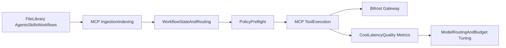

# Agentic Platform Upgrade Plan

## Outcome Target
- Move from a strong-but-drifting setup to a professional, repeatable agentic SDLC platform where:
  - file-based assets (`agents`, `skills`, `workflows`) remain first-class for Claude Code and human authoring,
  - MCP server becomes the runtime control plane for retrieval, workflow state, routing, and policy.
- Guardrails are mandatory by default:
  - security guardrails for tool execution, data handling, and approval boundaries,
  - cost guardrails for model routing, token budgets, and cache-aware retrieval behavior.

## Short Answer: Can the gaps be exposed through MCP?
- **Yes, mostly.** Your existing MCP server already exposes workflow, model-mapping, memory, and retrieval tools in [apps/mcp-server/src/Ryan.MCP.Mcp/McpTools/WorkflowTools.cs](d:/Projects/ai-stack/apps/mcp-server/src/Ryan.MCP.Mcp/McpTools/WorkflowTools.cs) and [apps/mcp-server/src/Ryan.MCP.Mcp/McpTools/ModelMappingTools.cs](d:/Projects/ai-stack/apps/mcp-server/src/Ryan.MCP.Mcp/McpTools/ModelMappingTools.cs).
- The highest-value missing pieces (policy gates, workflow state persistence, PR/CI automation, retrieval quality controls) are all straightforward to add as additional MCP tools/endpoints without replacing your file-based library.

## Current Status Notes
- Routing now includes explicit small-first selection, risk-triggered escalation, and budget fallback chain behavior in MCP model recommendations.
- Observability now includes an operator-facing dashboard loop tool and cache telemetry counters in addition to policy/workflow counters.
- Caching controls now include retrieval caps, scoped semantic cache with TTL/versioned invalidation, and stable prompt-prefix caching with explicit invalidate controls.

## Execution Strategy (Dual-Plane)
- **Authoring plane (files):** keep [library/agents](d:/Projects/ai-stack/library/agents), [library/skills](d:/Projects/ai-stack/library/skills), [library/workflows](d:/Projects/ai-stack/library/workflows), [library/templates](d:/Projects/ai-stack/library/templates).
- **Runtime plane (MCP):** use MCP tools for discovery, gating, memory, routing, and execution orchestration.
- **Config plane (gateway):** continue exposing safe auto tools in [infra/bifrost/bifrost.config.json](d:/Projects/ai-stack/infra/bifrost/bifrost.config.json), with policy tiers added next.

## Phase 1: Stabilize Contracts and Remove Drift
- Add a repo-level control document `AGENTS.md` at repo root to define:
  - canonical source-of-truth paths,
  - role boundaries and handoff contract,
  - mandatory SDLC artifacts per phase,
  - memory/RAG policy,
  - MCP tool policy tiers and approval rules.
- Add library-level guardrail contracts for all agents/skills:
  - required sections in every agent/skill (`allowed_tools`, `forbidden_actions`, `max_parallelism`, `budget_tier`, `escalation_triggers`),
  - secure defaults (`read-first`, `dry-run-then-apply`, no destructive ops without explicit user approval),
  - mandatory cite-and-justify policy for high-impact recommendations.
- Add reusable governance templates in the library for immediate copy/drop use:
  - `AGENTS.md` (project-level contract),
  - `CLAUDE.md` (Claude Code project/global guidance),
  - `.cursorrules` (Cursor project/global guidance),
  - paired `global` and `project` variants with clear merge/precedence notes.
- Reconcile routing drift in [library/agents/orchestrator.agent.md](d:/Projects/ai-stack/library/agents/orchestrator.agent.md):
  - every referenced agent must exist,
  - every workflow reference must point to canonical docs only.
- Canonicalize workflow docs to one source (avoid duplicated templates/command docs across directories).

## Phase 2: Ship 5 Professional SDLC Workflows (File + MCP)
- Add/upgrade these workflow specs under [library/workflows](d:/Projects/ai-stack/library/workflows):
  - `feature-delivery.workflow.md`
  - `incident-triage.workflow.md`
  - `spike-research.workflow.md`
  - `multi-agent-delivery.workflow.md`
  - `eval-regression.workflow.md`
- For each workflow, define machine-usable fields:
  - phase gates, inputs, required artifacts, stop/rollback conditions, done criteria.
- Extend MCP workflow tooling to support these workflows as first-class commands in [WorkflowTools.cs](d:/Projects/ai-stack/apps/mcp-server/src/Ryan.MCP.Mcp/McpTools/WorkflowTools.cs):
  - add list/get/start/step support for new commands,
  - include next-step hints and validation checkpoints.

## Phase 3: Add P0 MCP Gaps (Policy + Workflow State + Dev Loop)
- Add MCP tools/endpoints for:
  - `policy_preflight` (read/mutate/execute gating),
  - workflow state persistence (`workflow_state_upsert/get/list`),
  - PR/CI integration (`pr_checks_status`, `pr_create_or_update`, `issue_sync` or equivalent).
- Enforce tool category policy in runtime:
  - read tools auto-allowed,
  - mutate/execute tools require explicit approval token.
- Keep Bifrost auto-execute constrained to read-only set in [infra/bifrost/bifrost.config.json](d:/Projects/ai-stack/infra/bifrost/bifrost.config.json).
- Add explicit security controls at MCP boundary:
  - command allowlists for process-exec tools,
  - argument/schema validation before external tool invocation,
  - audit log envelope for each tool call (who, what, scope, decision, result),
  - policy-based deny for secret-like outputs and disallowed data domains.

## Phase 4: Token/Cost Optimization (Highest ROI First)
- Implement routing and budgeting around existing model mapping capabilities in [ModelMappingTools.cs](d:/Projects/ai-stack/apps/mcp-server/src/Ryan.MCP.Mcp/McpTools/ModelMappingTools.cs):
  - small model default,
  - escalate on confidence/risk thresholds,
  - per-workflow token/cost budgets.
- Add prompt/context controls:
  - strict retrieval caps (top-k, max chars/chunk),
  - rolling summary memory for long sessions,
  - stable prefix reuse for prompt caching.
- Add semantic cache after basic observability is in place:
  - scope keys (repo/branch/workflow/version),
  - TTL + invalidation on code/doc changes.
- Add hard budget guardrails:
  - per-request max token cap and per-workflow spend ceiling,
  - automatic fallback policy (`frontier -> capable -> small`) when confidence allows,
  - stop-and-confirm behavior when predicted spend exceeds threshold.

## Phase 5: Observability + Quality Gates
- Add operational metrics and dashboards for each workflow run:
  - tokens in/out, latency, cost, cache-hit rates,
  - tool invocation counts, failure rates,
  - retrieval quality and citation coverage.
- Introduce a continuous optimization loop:
  - compare quality vs cost per workflow,
  - tune routing thresholds and cache policy,
  - run regression eval before broad rollout.

## What You Should Own Manually (Do Not Fully Delegate)
- Final risk policy decisions:
  - which mutate/execute tools can run automatically,
  - approval requirements for production-impact actions.
- Security/compliance boundaries:
  - secrets handling, retention windows, PII policy.
- Business quality bar:
  - go/no-go criteria for feature ship and incident closure.
- Provider/commercial constraints:
  - model/provider contracts, spend ceilings, vendor selection.
- Guardrail acceptance policy:
  - define what must always be blocked,
  - define what requires human approval,
  - define what can auto-run under constrained budgets.

## What AI Agents Should Build/Operate
- Workflow markdown/templates + schema-aligned artifacts.
- MCP tool additions for workflow state, policy preflight, and dev-loop automation.
- Routing/budget policy scaffolding and observability instrumentation.
- Drift checks in CI (broken references, duplicate canon, schema conformance).
- Reusable drop-in governance files that can be copied into any repository with no scripting:
  - project-ready `AGENTS.md`, `CLAUDE.md`, `.cursorrules`,
  - optional user/global variants for local tool defaults.

## Immediate Deliverables (Actionable Now)
- `AGENTS.md` v1 + canonical source-of-truth map.
- 5 workflow docs (spec-based, bug triage, spike, multi-agent, eval loop).
- MCP `policy_preflight` + workflow-state tools.
- Routing policy doc (small-first + escalation + budget caps).
- Metrics baseline dashboard/report for token/cost/latency/retrieval quality.
- Guardrail pack v1:
  - `security-guardrails.md` (tool risk tiers, allowed/blocked actions),
  - `cost-guardrails.md` (budget tiers, escalation/fallback matrix),
  - `agent-contract.schema.json` (required guardrail metadata per agent/skill),
  - CI check to fail on missing guardrail fields.
- Governance template pack v1 (copy/paste friendly):
  - `templates/governance/project/AGENTS.md`
  - `templates/governance/project/CLAUDE.md`
  - `templates/governance/project/.cursorrules`
  - `templates/governance/global/AGENTS.md`
  - `templates/governance/global/CLAUDE.md`
  - `templates/governance/global/.cursorrules`
  - `templates/governance/README.md` documenting precedence, recommended defaults, and MCP usage boundaries.

## Governance File Design Requirements
- Files must be standalone and immediately usable when copied into a target repo/user scope.
- No scripts, symlinks, generation steps, or runtime templating required.
- Each file must include:
  - MCP usage policy (allowed tool classes, approval gates, blocked actions),
  - cost policy (budget tiers, escalation/fallback behavior),
  - SDLC workflow expectations (spec-first and quality gates),
  - evidence/citation expectations for decisions,
  - incident and rollback discipline for production-impact changes.
